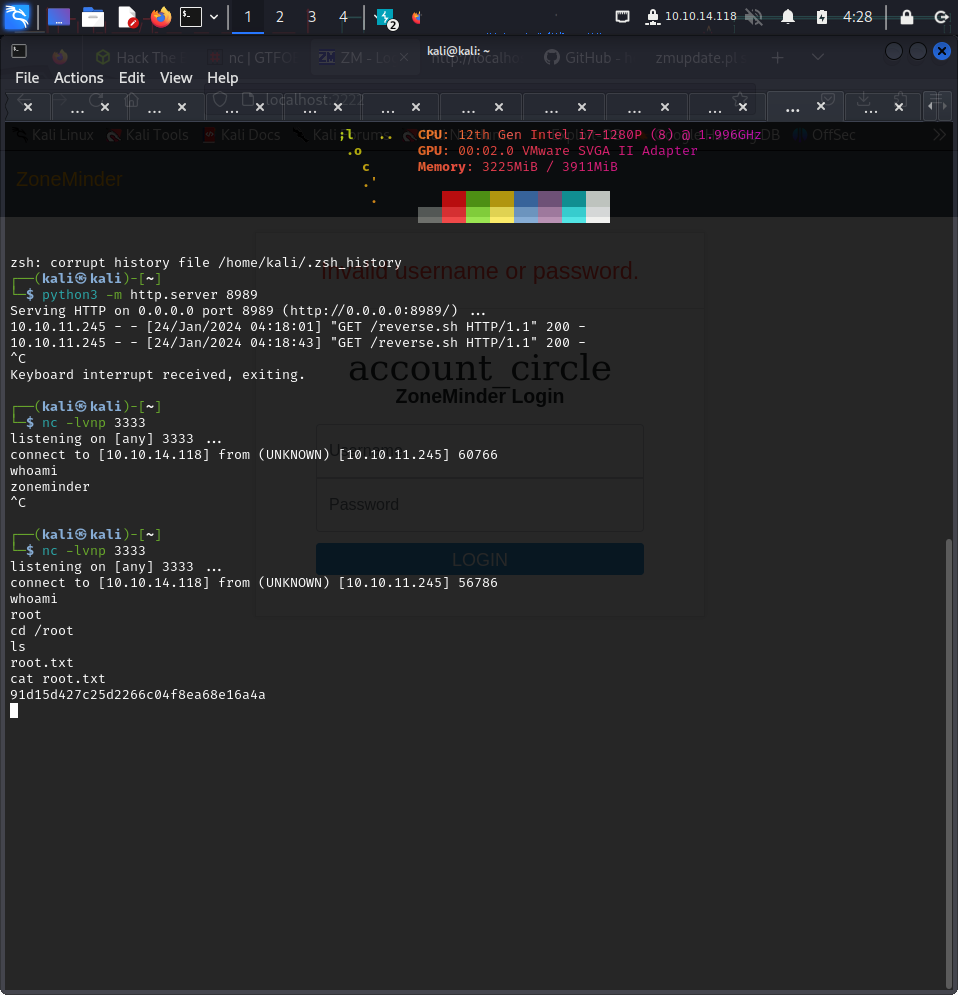
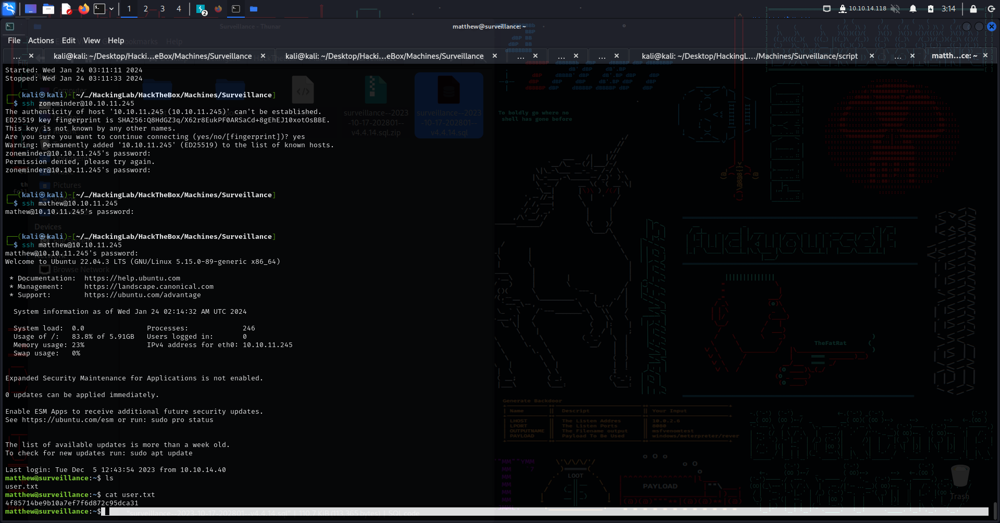

# HackTheBox - Surveillance Box Writeup

## Introduction

This markdown file contains my notes and findings from the Surveillance box on HackTheBox. It outlines the steps I took to compromise the system and obtain root access.

## Initial Reconnaissance

- Conduct an NMAP scan to identify open ports and services.
- Identify an open HTTP port and check if a webpage is viewable in a web browser.

## Web Application Enumeration

- Resolve webpage issues by adding the IP and DNS name to `/etc/hosts`.
- Perform directory busting using GoBuster.
- Discover an admin login running Craft CMS by examining the source code of `surveillance.htb/index.php`.

## Exploiting Craft CMS

- Identify the version of Craft CMS by viewing the source code.
- Find a Remote Code Execution (RCE) Proof of Concept (PoC) for the discovered version.
- Edit the script as instructed in the PoC to obtain a shell.

## Establishing a Stable Shell

- Use a [one-liner](#one-liner) for a stable shell using Netcat and Bash commands.
- [Breakdown](#one-liner-breakdown) of the one-liner's components explained.

## Privilege Escalation

- Find a backup directory in the storage and copy it to the web server.
- Use wget to extract the file and crack the hashed password for the user "Matthew."
- Use the cracked password to access SSH and obtain user privileges.

## Enumerating MySQL Credentials

- Run linpeas to check for credentials.
- Find MySQL credentials related to the database stored in the storage/backups directory.
- Investigate configurations related to "zoneminder."

## Exploiting ZoneMinder

- Discover ZoneMinder software and initiate port forwarding using SSH.
- Identify a login page for ZoneMinder and attempt default credentials (admin:admin).
- Determine the version (1.36.32) and find an exploit PoC for ZoneMinder.
- Explore different options, including Metasploit exploits involving snapshots.

## Local Privilege Escalation (LPE)

- Check sudo privileges using `sudo -l`.
- Spawn a stable shell via Python.

## Root Access

- Exploit a vulnerability in `zmupdate.pl` by inputting a file directory instead of a user.
- Use a reverse shell script, transfer it via the Python server, and run it.
- Utilize busybox to access the netcat command.
- [Alternative method](#alternative-method) using `/bin/bash -i` instead of a reverse shell file.
- Obtain root access and find the root flag.

## Update and Keynotes

- Discover an alternative for root access without using a reverse shell file.
- Acknowledge the importance of studying port forwarding and reading code.
- Note the significance of learning more about busybox, the Swiss Army knife of embedded Linux.

---

## Figures

### root flag

### user flag

