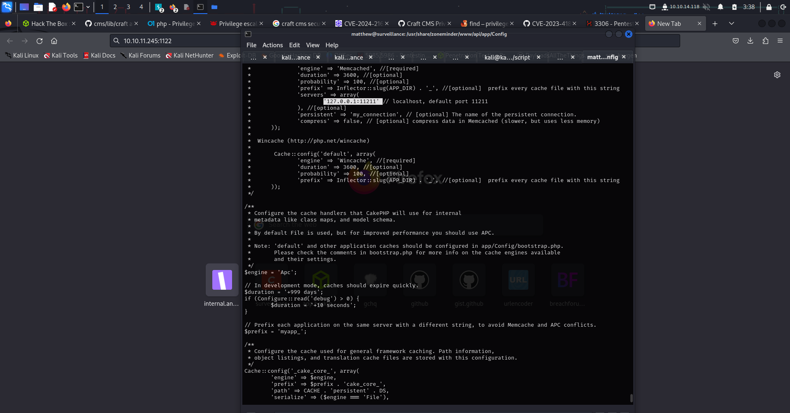
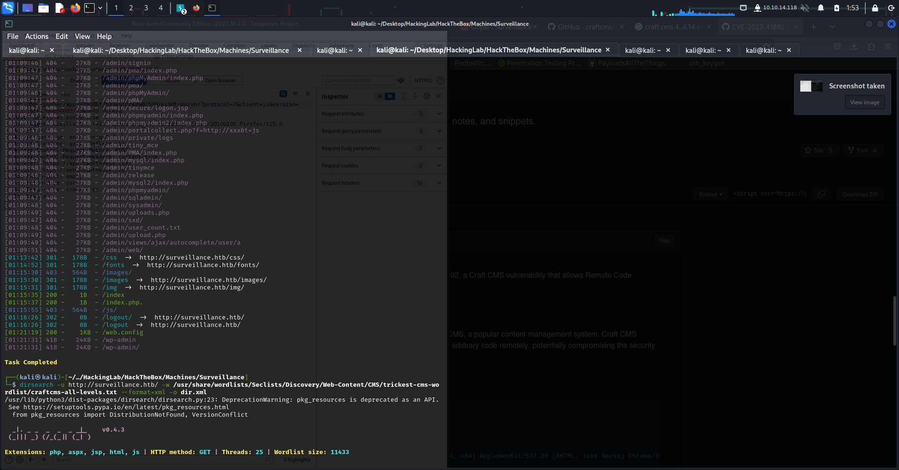
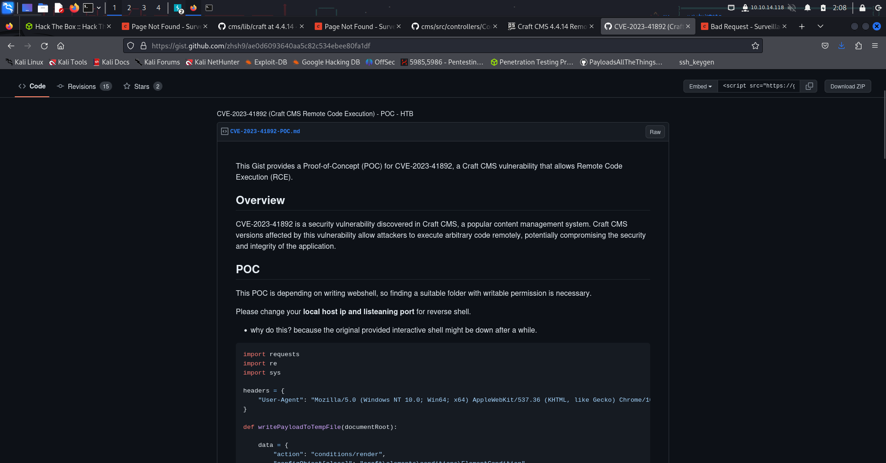
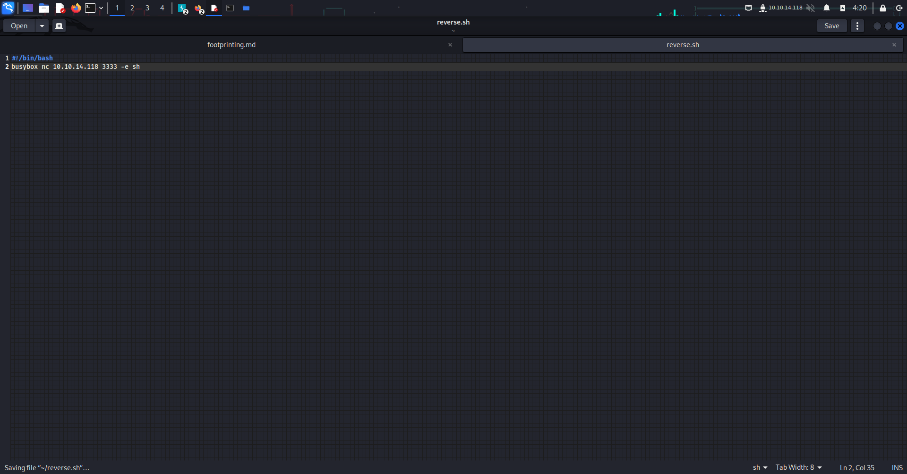
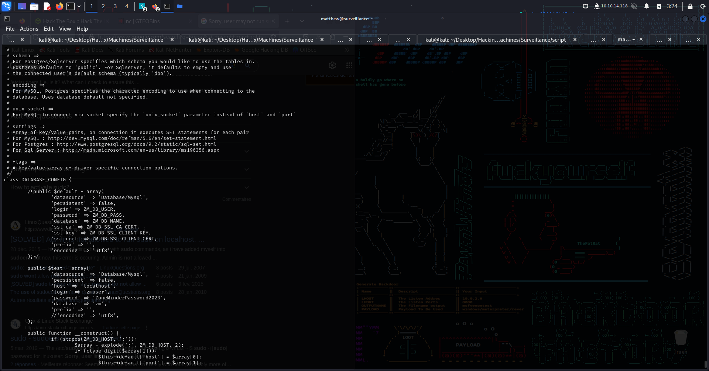

<!DOCTYPE html>
<html lang="en">

<head>
    <meta charset="UTF-8">
    <meta name="viewport" content="width=device-width, initial-scale=1.0">
    <title>HackTheBox - Surveillance Box Writeup</title>
</head>

<body>

    <h1>HackTheBox - Surveillance Box Writeup</h1>

    <h2>Introduction</h2>
    
This markdown file contains my notes and findings from the Surveillance box on HackTheBox. It outlines the steps I took to compromise the system and obtain root access.

    <h2>Initial Reconnaissance</h2>
    <ul>
        <li>Conduct an NMAP scan to identify open ports and services.</li>
        <li>Identify an open HTTP port and check if a webpage is viewable in a web browser.</li>
    </ul>

    <h2>Web Application Enumeration</h2>
    <ul>
        <li>Resolve webpage issues by adding the IP and DNS name to /etc/hosts.</li>
        <li>Perform directory busting using GoBuster.</li>
        <li>Discover an admin login running Craft CMS by examining the source code of surveillance.htb/index.php.</li>
    </ul>

    <!-- ... More content ... -->

    <h2>Figures</h2>

    <!-- Link images from the Figures directory -->
    
    
    
    
    
    
    <!-- Add more image links as needed -->

    <h2>Update and Keynotes</h2>
    <ul>
        <li>Discover an alternative method for root access without using a reverse shell file.</li>
        <li>Acknowledge the importance of studying port forwarding and reading code.</li>
        <li>Note the significance of learning more about busybox, the Swiss Army knife of embedded Linux.</li>
    </ul>

</body>

</html>

