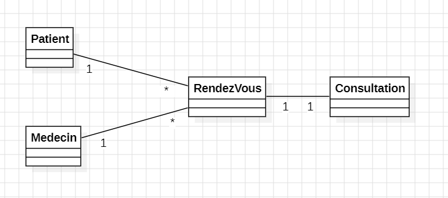
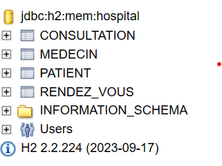
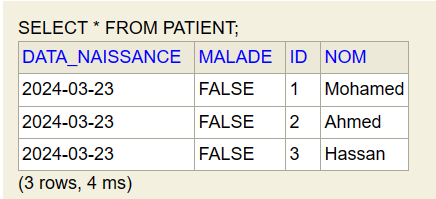
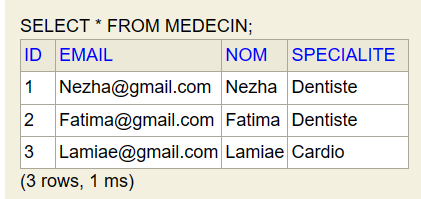
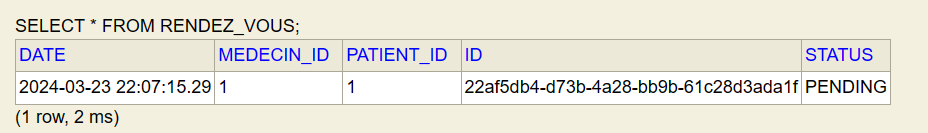
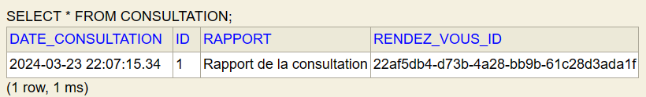
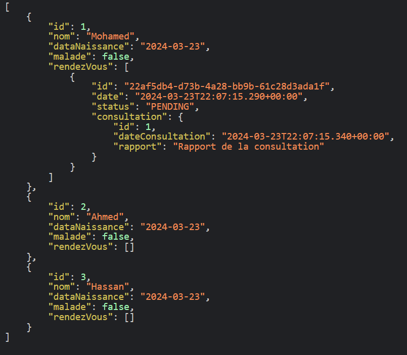

<h2>Compte rendu de l'activité ORM JPA Hibernate Spring Data (One to many) HOSPITAL</h2>
<h4>Diagramme de classe</h4>

Dans cette activité j'ai créé trois packages:

<li>entities: qui contient les classes Patient,Medecin,RendezVous et Consultation
qui seront mes tables dans la base de données</li>
<li>repositories: qui contient les interfaces qui héritent de JpaRepository </li>
<li>Service : qui contient l'inteface Service et son implémentation </li>
<li>web : affiche les données sous format JSON</li>
<h4>Base de données H2</h4>

<h4>table Patient</h4>

<h4>table Medecin</h4>

<h4>table RendezVous</h4>

<h4>table Consultation</h4>

<h4>liste des patiens en format JSON</h4>

