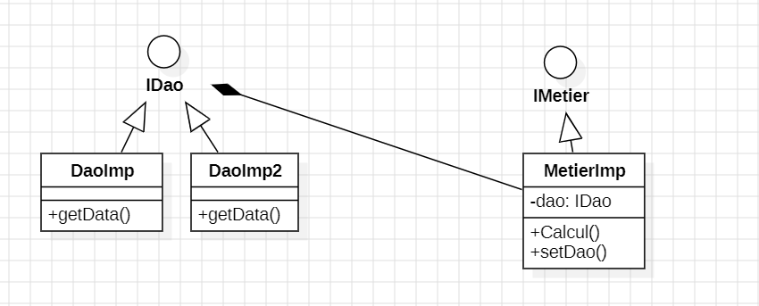
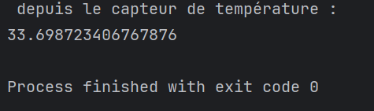

<h3>Compte rendu de l'activité " Injection des dépendances"<h3>
<h4>Diagramme de classe<h4>

<h4>Injection de dépendances</h4>

Pour faire l'injection des dépendances j'ai procédé selon les 4 méthodes suivantes:

<li>Instanciation statique</li>
<li>Instanciation dynamique</li>
<li>Version XML (Framework Spring)</li>
<li>Version annotations (Framework Spring)</li>

<h4>Instanciation statique<h4>

Utilisation de l'operateur new

<h4>Instanciation dynamique</h4>

Utilisation d'un fichier txt (config.txt) qui contient le nom des classes
que l'on souhaite instancier et on utilise les méthodes forName() et newInstance()
pour instancier la classe lue à partir du fichier config.txt

<h4>Version XML (Framework Spring)</h4>

La création du fichier xml (applicationContext.xml) qui va permettre l'instanciation de l'objet qui sera 
accessible via l'ID "dao" et l'injection de ce dernier dans l'objet de type (MetierImp) 
qui sera instancier par la suite 

<h4>Version annotations (Framework Spring)</h4>

l'utilisation de l'annotation @Component qui va permettre l'instanciation
des classes en question puis l'utilisation de @Autowired et @Qualifier pour injecter la dependances 

