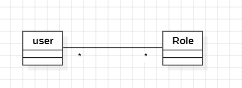
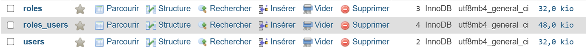
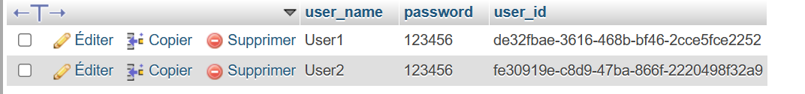
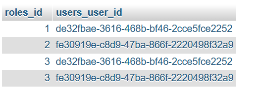
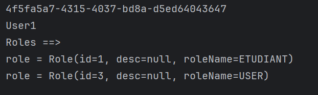
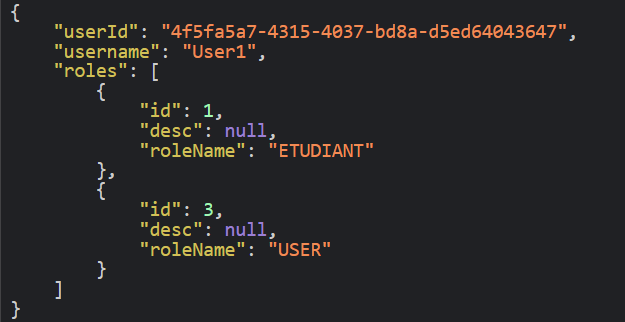

<h2>Compte rendu de l'activité ORM JPA Hibernate Spring Data (many to many) User-Role</h2>
<h4>Diagramme de classe</h4>

Dans cette activité j'ai créé trois packages:

<li>entities: qui contient les classes Role et User
qui seront mes tables dans la base de données</li>
<li>repositories: qui contient les interfaces qui héritent de JpaRepository </li>
<li>Service : qui contient l'inteface Service et son implémentation </li>
<li>web : affiche les données sous format JSON</li>
<h4>Base de données</h4>

<h4>Table User</h4>

<h4>Table Role</h4>

<h4>Table association User_Role</h4>

<h4>L'Authentification</h4>

<h4>Affichage des informations d'un utilisateur à partir de son username</h4>

